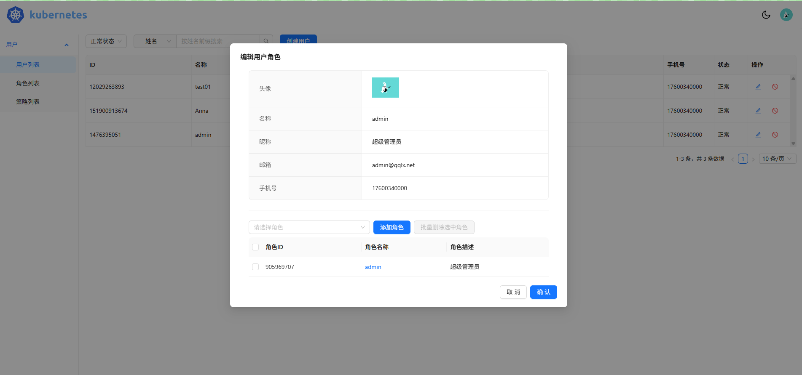
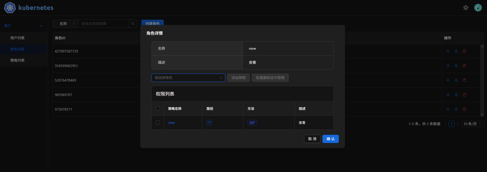

# 用户管理前端

后端地址：[https://github.com/qinquanliuxiang/go-web](https://github.com/qinquanliuxiang/go-web)

## 展示




## 开发环境

基于 react + typescript + antd + vite

## 功能

1. 用户登录
2. 用户注册
3. 用户管理
4. 权限管理
5. 角色管理

## 启动

静态文件服务器使用的是 `Caddy` 使用 `docker compose` 启动, 可以自动完成证书的申请和配置。

* `conf` 目录存储 `Caddy` 配置文件, 按需修改其中的主机名。
* `site` 存放的是编译之后的静态资源。

```bash
# 编译部署
make deploy

# 启动 docker compose
make up
```
