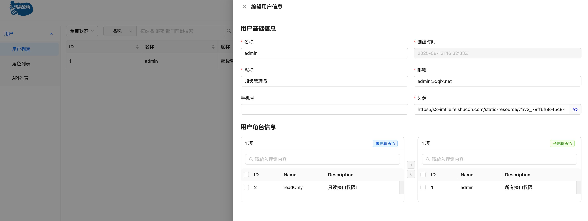
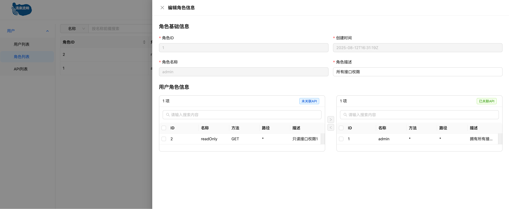
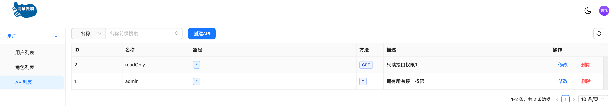
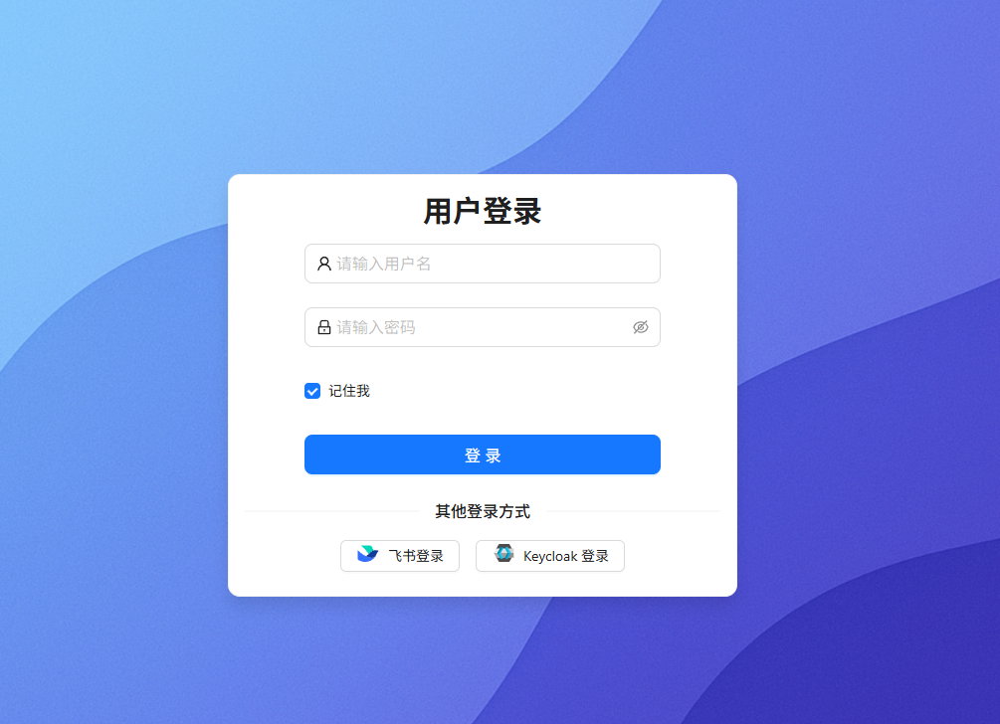
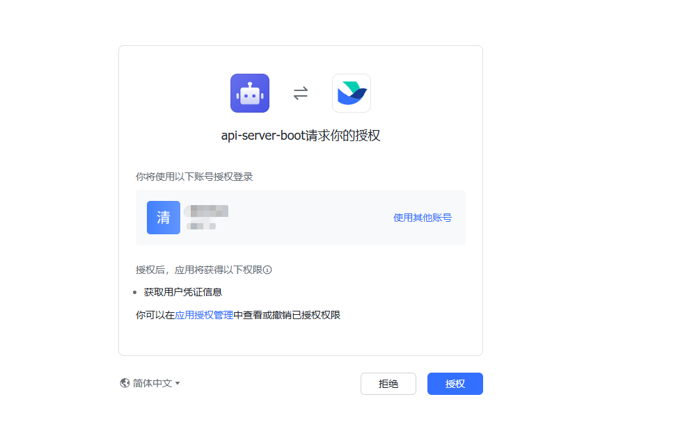

# yiran-ui

## 简介

前端项目

基于 react + typescript + antd + vite 构建的前端项目，[后端地址](https://github.com/yiran15/api-server)

## 功能

### 用户管理



### 角色管理



### 接口权限管理



### OAuth2 登录

支持 OAuth2 登录，目前支持飞书、keycloak。




## 启动

静态文件服务器使用的是 `Caddy` 使用 `docker compose` 启动, 可以自动完成证书的申请和配置。

- `conf` 目录存储 `Caddy` 配置文件, 按需修改其中的主机名。
- `site` 存放的是编译之后的静态资源。

```bash
# 编译部署
make deploy

# 启动 docker compose
make up
```
